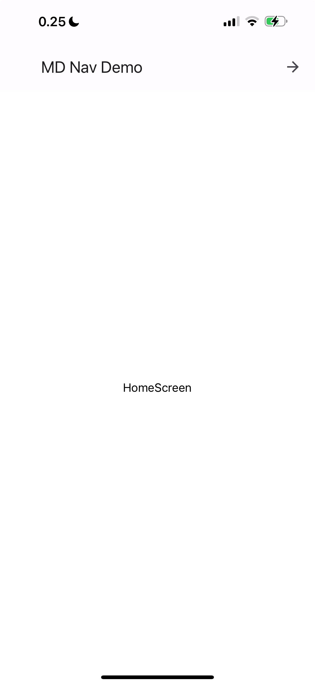
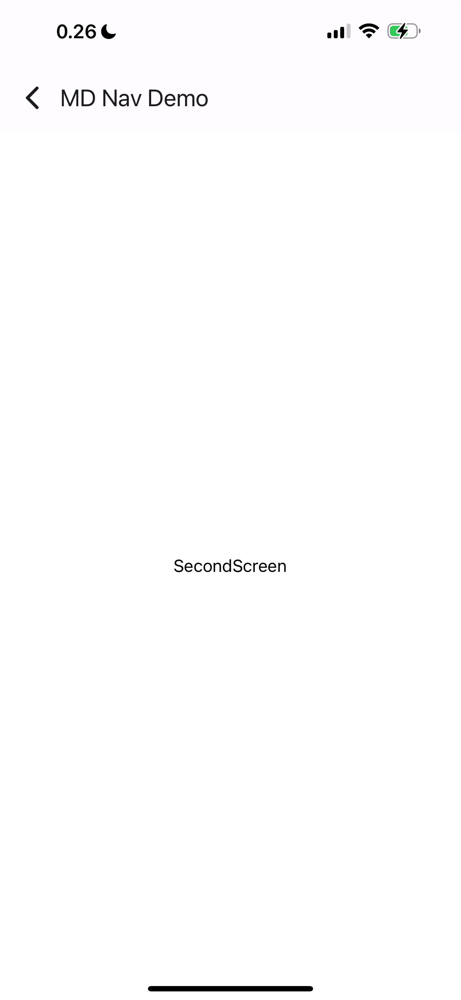

# Web-ja-hybriditeknologiat-mobiiliohjelmoinnissa-viikkotehtava-3

## Excercise. Material design and navigation

During this exercise Stack navigation and Material design libraries are used to create simple application.
User can navigate from home screen to second screen. Application bar from React Native Paper is used (instead of default one from React Native).

## Implemented UI

